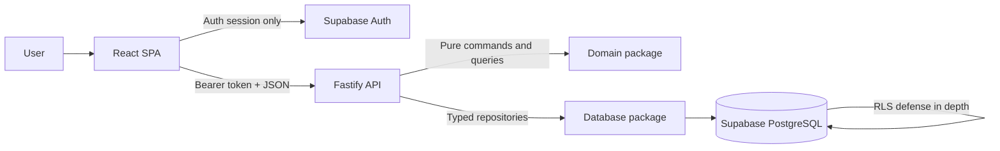
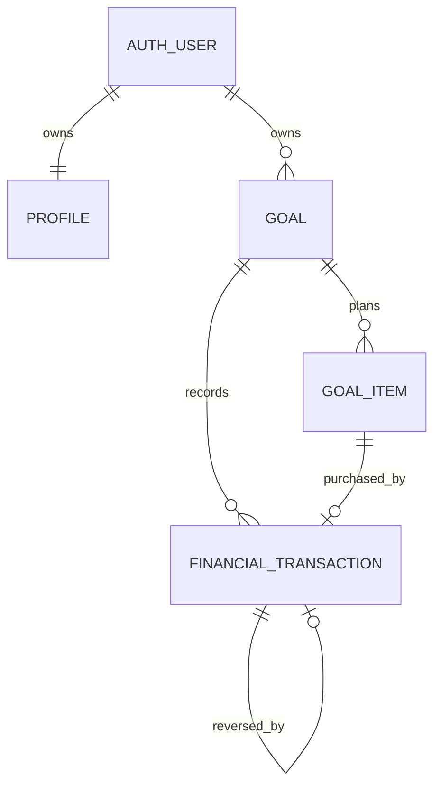
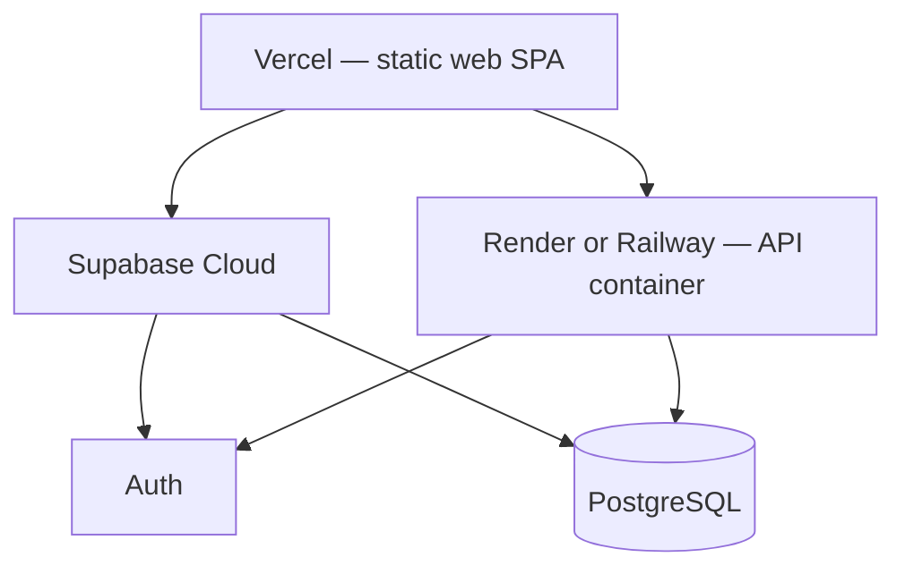

# Goal Tracker — Architecture Blueprint

**Status:** Approved simplified blueprint
**Last updated:** 2026-07-29

This document shows system boundaries and dependency direction. Product rules live in the product
requirements; implementation decisions live in the technical architecture.

## 1. System context



The browser never writes application tables directly. Authentication is the only direct
browser-to-Supabase flow.

## 2. Aggregate



`Goal` is the single consistency boundary. Items and transactions cannot move between goals.
Deleting a goal permanently deletes its dependent rows after explicit confirmation.

## 3. Sources of truth

| Concern | Authoritative source | Derived output |
|---|---|---|
| Ownership | `goals.user_id` and profile owner | Authorization decision |
| Money movement | Financial ledger | Funded, spent, available |
| Fixed target | `goals.fixed_target_minor` | Remaining amount |
| Item target | Expected prices plus actual purchases | Current target |
| Purchase state | Purchase and undo ledger entries | Purchased badge and actual price |
| Pace | Goal plan, items, ledger, calculation month | Status and recommendation |
| Simulation | Request payload only | Temporary report |

There is no second writable representation of a derived value.

## 4. Backend modules

```text
apps/api/src/modules/
  profile/
  goals/
  items/
  finance/
  guidance/
  simulation/

packages/domain/src/
  money/
  months/
  targets/
  ledger/
  projection/
  simulation/

packages/database/src/
  schema/
  repositories/
  transactions/

packages/contracts/src/
  profile/
  goals/
  items/
  finance/
  guidance/
  simulation/
```

Routes remain thin. Application services own authorization and transaction boundaries. Repositories
own queries, not business rules. Pure domain engines own all monetary and projection decisions.

## 5. Critical flows

### Contribution, withdrawal, edit, or delete

```mermaid
sequenceDiagram
    participant W as Web
    participant A as API
    participant P as PostgreSQL
    participant L as Ledger Engine
    W->>A: Command + access token
    A->>P: Begin; lock owned goal
    A->>P: Load ordered ledger
    A->>L: Replay proposed history
    L-->>A: Valid totals or domain error
    A->>P: Persist and commit
    A-->>W: Transaction + current derived summary
```

An invalid historical prefix rolls back the whole command.

The web sends each financial command once and disables its form while pending. It does not
automatically replay a command whose response is lost. When the result is unknown, it reloads the
goal detail and ordered history before enabling another submission. This reconciliation uses
committed ledger state and requires no offline queue or idempotency storage.

### Purchase and undo

The API locks the goal, loads the item and full ledger, verifies ownership and state, then asks the
ledger engine to replay:

- purchase requires enough available money and no active purchase for the item;
- undo references exactly one unreversed purchase and reverses its full amount;
- item target calculation immediately uses expected or actual price based on the resulting ledger.

### Goal detail query

The API loads the goal, items, and ordered ledger once. Domain functions derive target and ledger
summary, then the projection entry point derives guidance. The response contains render-ready
results and explanations. The web does not reconstruct them.

### Simulation

The API validates at most three sequential contribution phases and calls the pure simulation engine
with the current aggregate. The engine applies each per-contribution amount once or twice per month
according to the goal frequency, then reports monthly totals and item affordability. No transaction
begins and no row is written.

## 6. Security boundaries

```text
Untrusted:
  browser input, owner IDs in URLs, access tokens until verified

Trusted only after validation:
  authenticated user ID, parsed DTOs, repository results scoped to that user

Privileged:
  API database credentials, signing secrets, SMTP credentials, backup material
```

Every goal child lookup joins through or first resolves an owned goal. A missing resource and a
foreign resource use a non-leaking not-found response where appropriate. RLS independently prevents
authenticated database users from crossing ownership boundaries.

## 7. Deployment boundary

The reference deployment is managed:



Public routes, project URLs, and external URLs are environment-driven; the platforms terminate TLS
and Supabase Cloud manages backups. A deployment is incomplete until signup policy, recovery
behavior, secrets, and platform plan limitations are documented. The self-hosted option replaces
the managed services with pinned Docker images behind a reverse proxy and its own backup and
restore rehearsal; it is documented as an appendix without additional MVP hardening.

## 8. Change rule

A feature may cross these boundaries only after:

1. the product requirements define its user-visible behavior;
2. its authoritative data and invariants are identified;
3. the implementation plan assigns it to a milestone;
4. tests prove isolation and financial correctness where applicable.

Avoid generic frameworks, plugin systems, event buses, and caches until current product behavior
demonstrates a concrete need.
