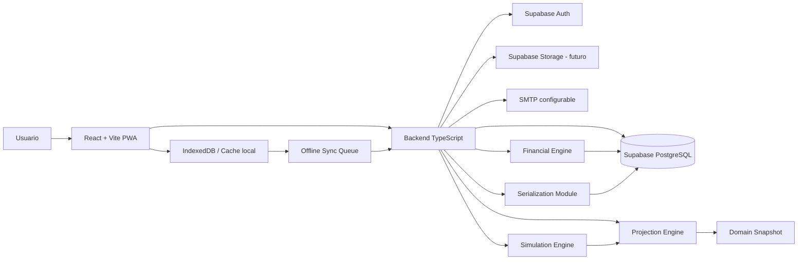
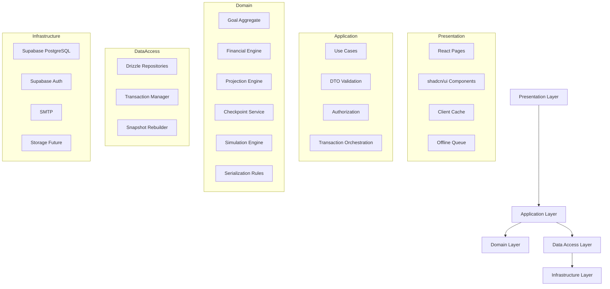
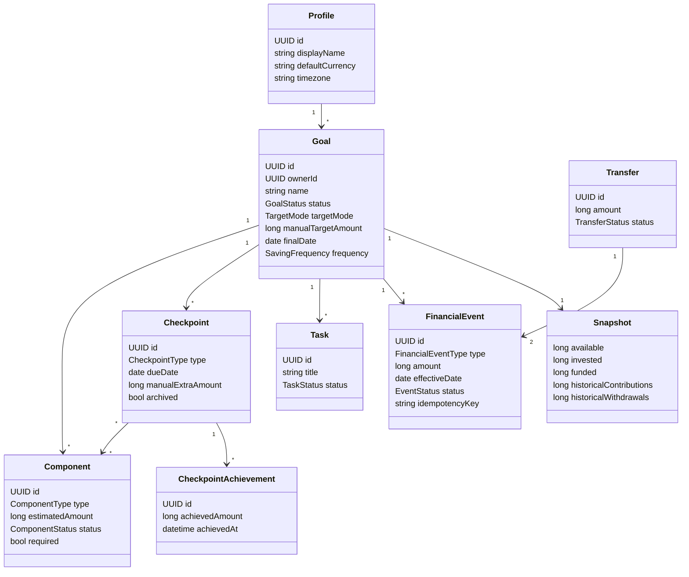
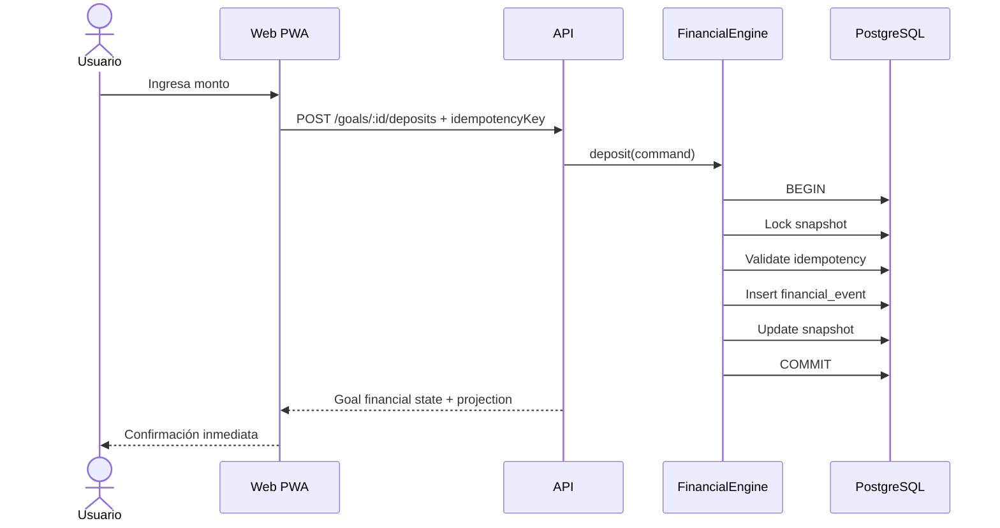
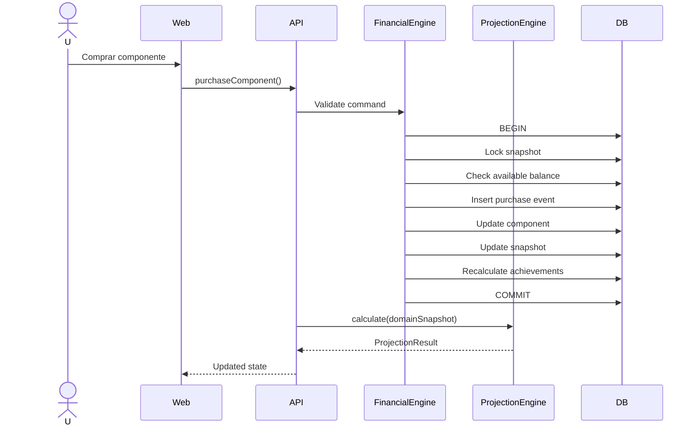
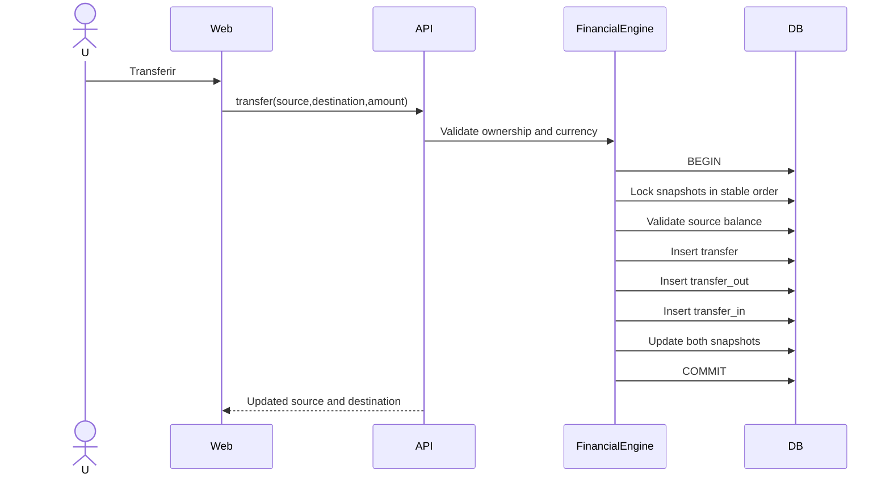
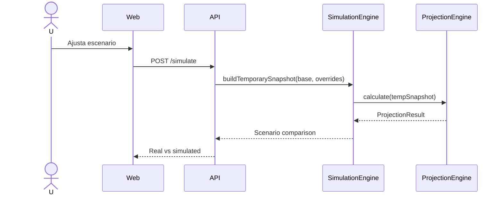
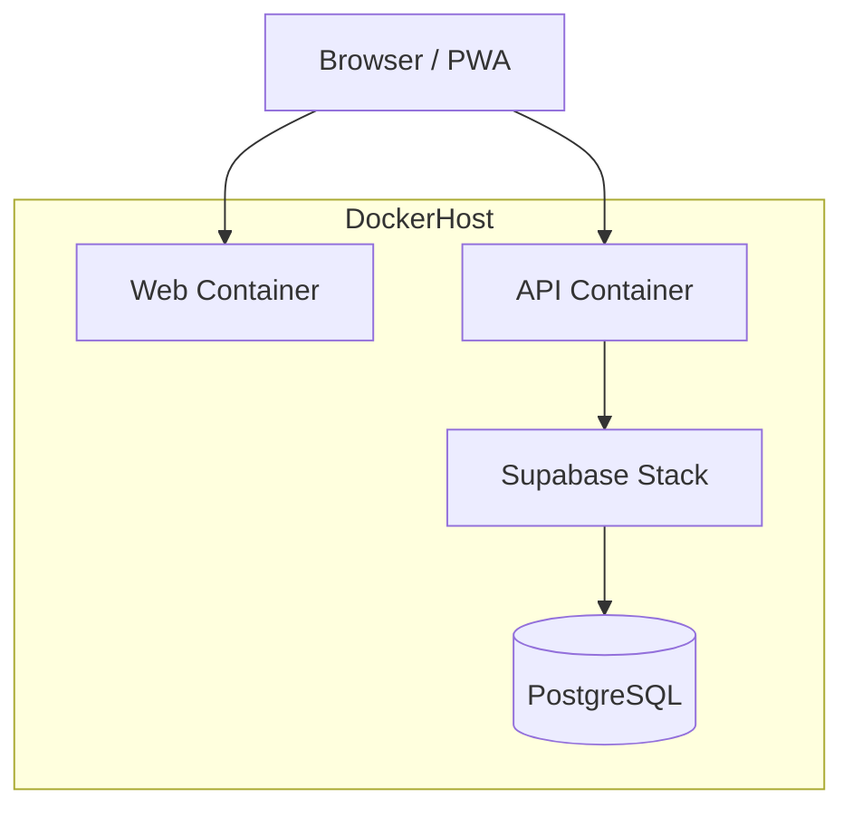
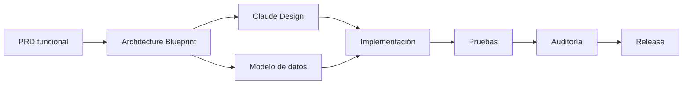

# Goal Tracker — Architecture Blueprint

> **Status:** Architecture Blueprint v1
>
> Este documento traduce el PRD funcional y la arquitectura técnica en una vista integrada del sistema. Su objetivo es servir como referencia para diseño, implementación, pruebas y evolución futura.

---

# 1. Propósito

Goal Tracker es una SPA/PWA self-hosted para planificar y completar objetivos económicos personales.

La arquitectura debe:

- mantener una única fuente de verdad para reglas financieras;
- evitar lógica duplicada entre frontend, backend, IA y futuras apps;
- ofrecer integridad transaccional;
- soportar aportes offline;
- conservar trazabilidad;
- ser simple de desplegar;
- permitir evolución razonable sin sobreingeniería.

---

# 2. Vista general del sistema



---

# 3. Principios arquitectónicos

## 3.1 Backend como fuente de verdad

El frontend nunca define reglas financieras autoritativas.

Toda mutación financiera pasa por el backend.

## 3.2 Eventos como fuente de verdad financiera

Los movimientos monetarios se representan mediante eventos válidos.

Los snapshots son reconstruibles.

## 3.3 Motores puros

El `ProjectionEngine` y el núcleo de simulación:

- no escriben en base de datos;
- no consultan Supabase;
- no hacen llamadas externas;
- reciben entrada y producen salida determinista.

## 3.4 Integridad primero

Las operaciones críticas usan:

- transacciones;
- locks;
- idempotencia;
- reconstrucción;
- constraints;
- RLS.

## 3.5 Simplicidad operativa

- monorepo;
- Docker Compose;
- PostgreSQL;
- Supabase;
- Drizzle;
- migraciones Supabase;
- SPA/PWA.

---

# 4. Arquitectura por capas



---

# 5. Monorepo propuesto

```text
goal-tracker/
├── apps/
│   ├── web/
│   │   ├── src/
│   │   │   ├── app/
│   │   │   ├── routes/
│   │   │   ├── features/
│   │   │   ├── components/
│   │   │   ├── offline/
│   │   │   └── lib/
│   │   └── public/
│   │
│   └── api/
│       └── src/
│           ├── modules/
│           ├── middleware/
│           ├── infrastructure/
│           └── main.ts
│
├── packages/
│   ├── domain/
│   │   ├── financial/
│   │   ├── projections/
│   │   ├── checkpoints/
│   │   ├── simulations/
│   │   └── shared/
│   │
│   ├── database/
│   │   ├── schema/
│   │   ├── repositories/
│   │   └── generated-types/
│   │
│   ├── contracts/
│   │   ├── api/
│   │   ├── serialization/
│   │   └── validation/
│   │
│   ├── ui/
│   └── config/
│
├── supabase/
│   ├── migrations/
│   ├── seed.sql
│   └── config.toml
│
├── docs/
├── tests/
├── docker-compose.yml
├── package.json
└── pnpm-workspace.yaml
```

## 5.1 Regla de dependencias

```text
web -> contracts, ui
api -> domain, database, contracts
domain -> shared only
database -> contracts, generated types
ui -> no domain logic
```

El paquete `domain` no depende de Supabase, Drizzle, React ni HTTP.

---

# 6. Módulos principales

## 6.1 Goals

Responsable de:

- crear objetivo;
- editar configuración;
- cambiar estado;
- archivar;
- enviar a papelera;
- restaurar;
- cerrar;
- duplicar.

## 6.2 Components

Responsable de:

- compra única;
- presupuesto;
- costos;
- estados derivados;
- cancelación;
- relación con checkpoints.

## 6.3 Checkpoints

Responsable de:

- orden acumulativo;
- monto vigente;
- cobertura;
- logros históricos;
- checkpoint final;
- checkpoint crítico.

## 6.4 Financial

Responsable de:

- aportes;
- retiros;
- compras;
- gastos;
- transferencias;
- devoluciones;
- anulaciones;
- snapshots;
- reconstrucción.

## 6.5 Projections

Responsable de:

- periodos;
- aporte mínimo;
- aporte ideal;
- fecha proyectada;
- tranquilidad;
- explicación;
- siguiente acción.

## 6.6 Simulations

Responsable de:

- overrides;
- comparación de escenarios;
- ejecución sin efectos secundarios.

## 6.7 Serialization

Responsable de:

- backup;
- restore;
- CSV;
- JSON;
- plantillas;
- versionado;
- validación de archivos.

## 6.8 Offline Sync

Responsable de:

- cola local;
- idempotency key;
- reintentos;
- estados pendientes;
- resolución de conflictos simples.

---

# 7. Modelo de dominio



---

# 8. Modelo financiero

## 8.1 Fórmulas

```text
Disponible =
  aportes
  + transferencias recibidas
  + devoluciones
  - retiros
  - transferencias enviadas
  - compras
  - gastos

Invertido =
  compras
  + gastos
  - devoluciones

Financiado =
  Disponible + Invertido
```

## 8.2 Invariantes

- Disponible >= 0
- Invertido >= 0
- Financiado >= 0
- No existe doble gasto.
- Una transferencia confirma ambos lados o ninguno.
- Una devolución no supera el monto pendiente de devolver.
- Una anulación revierte exactamente el evento original.
- Un evento idempotente no se procesa dos veces.

---

# 9. Flujo: registrar aporte



---

# 10. Flujo: compra única



---

# 11. Flujo: transferencia



---

# 12. Flujo: simulación



No se escribe nada en PostgreSQL.

---

# 13. Projection Engine

## 13.1 Entrada

```ts
type ProjectionInput = {
  goal: GoalSnapshot
  financial: FinancialSnapshot
  components: ComponentSnapshot[]
  checkpoints: CheckpointSnapshot[]
  periods: SavingPeriod[]
  achievements: AchievementSnapshot[]
}
```

## 13.2 Salida

```ts
type ProjectionResult = {
  tranquility: {
    status: TranquilityStatus
    explanation: ExplanationNode
  }
  recommendations: RecommendedAction[]
  criticalCheckpoint: CheckpointProjection | null
  projectedCompletionDate: string | null
  minimumContribution: number | null
  idealContribution: number | null
  marginDays: number | null
  remainingPeriods: number
  consumedPeriods: number
  expectedProgress: number | null
  actualProgress: number
}
```

## 13.3 Regla de pureza

```text
same input -> same output
```

---

# 14. API conceptual

## Goals

```text
POST   /goals
GET    /goals
GET    /goals/:id
PATCH  /goals/:id
POST   /goals/:id/archive
POST   /goals/:id/restore
POST   /goals/:id/close
DELETE /goals/:id
```

## Components

```text
POST   /goals/:id/components
PATCH  /components/:id
POST   /components/:id/cancel
POST   /components/:id/purchase
POST   /components/:id/expenses
POST   /components/:id/refunds
```

## Checkpoints

```text
POST   /goals/:id/checkpoints
PATCH  /checkpoints/:id
POST   /checkpoints/:id/archive
```

## Financial

```text
POST   /goals/:id/deposits
POST   /goals/:id/withdrawals
POST   /transfers
POST   /financial-events/:id/void
PATCH  /financial-events/:id
```

## Projection and Simulation

```text
GET    /goals/:id/projection
POST   /goals/:id/simulations
```

## Serialization

```text
GET    /exports/full
GET    /goals/:id/export
POST   /imports/template
POST   /restore
```

---

# 15. Seguridad

## 15.1 Defensa en profundidad

1. Supabase Auth valida identidad.
2. Backend valida sesión.
3. Backend valida propiedad.
4. RLS limita acceso directo.
5. PostgreSQL aplica constraints.
6. Financial Engine valida reglas contextuales.

## 15.2 Política de acceso

Toda fila privada incluye o deriva `owner_id`.

El usuario solo puede acceder a sus datos.

## 15.3 Mutaciones

Las mutaciones financieras nunca se exponen como inserciones directas desde el cliente.

---

# 16. Offline

## 16.1 Alcance MVP

Permitido offline:

- leer datos cacheados;
- registrar aportes.

## 16.2 Cola local

Cada aporte offline contiene:

- clientOperationId;
- goalId;
- amount;
- effectiveDate;
- createdAt;
- status.

## 16.3 Estados

```text
pending
syncing
synced
needs_review
failed
```

## 16.4 Idempotencia

`clientOperationId` se envía como `idempotency_key`.

---

# 17. Importación y exportación

## 17.1 Formatos

- Full backup JSON
- Goal export JSON
- Template JSON
- CSV

## 17.2 Versionado

```json
{
  "schemaVersion": "1.0",
  "exportType": "goal-template",
  "exportedAt": "...",
  "payload": {}
}
```

## 17.3 Seguridad

- validar tamaño;
- validar esquema;
- rechazar versiones incompatibles;
- no importar movimientos en una plantilla;
- no aplicar parcialmente datos ambiguos.

---

# 18. Despliegue



## 18.1 Docker Compose

Servicios previstos:

- web;
- api;
- Supabase services;
- PostgreSQL;
- SMTP opcional para desarrollo;
- reverse proxy opcional.

---

# 19. Observabilidad

MVP:

- logs estructurados básicos;
- correlation ID;
- errores financieros;
- errores de sync;
- fallos de importación;
- fallos de auth.

Fuera del MVP:

- tracing distribuido;
- métricas avanzadas;
- dashboards operativos.

---

# 20. Estrategia de pruebas

## Unitarias

- Financial Engine
- Projection Engine
- Checkpoint rules
- Simulation Engine
- Serialization validators

## Integración

- Drizzle + PostgreSQL
- transacciones
- locks
- RLS
- migraciones
- reconstrucción de snapshots

## End-to-end

- Japón
- Home Gym
- transferencia
- compra
- gasto
- devolución
- cierre
- offline sync
- importación/exportación

---

# 21. Flujo de desarrollo



---

# 22. Riesgos arquitectónicos

## R1. Complejidad de Supabase self-hosted

Mitigación:

- Docker Compose oficial;
- documentación estricta;
- mantener lógica en backend TypeScript;
- limitar dependencia de features propietarias.

## R2. Divergencia entre eventos y snapshots

Mitigación:

- reconstrucción automática;
- verificaciones periódicas;
- eventos como fuente de verdad.

## R3. Sobrecarga de lógica financiera

Mitigación:

- un único Financial Engine;
- tests exhaustivos;
- invariantes explícitas.

## R4. Offline conflictivo

Mitigación:

- offline limitado;
- solo aportes;
- idempotencia;
- `needs_review`.

## R5. Duplicación de reglas

Mitigación:

- dominio compartido;
- backend autoritativo;
- motores puros.

---

# 23. Decisiones consolidadas

- React + Vite + TypeScript.
- shadcn/ui.
- SPA + PWA.
- Supabase + backend TypeScript.
- PostgreSQL.
- Drizzle.
- Migraciones Supabase.
- Monorepo.
- Eventos financieros como fuente de verdad.
- Snapshots reconstruibles.
- Financial Engine único.
- Projection Engine puro.
- Simulation Engine en memoria.
- Docker Compose.
- UUID v4.
- Montos como enteros.
- Backend autoritativo.
- IA futura mediante tools.

---

# 24. Próximos entregables derivados

1. `GoalTracker_Domain_Model.md`
2. `GoalTracker_Database_Spec.md`
3. `GoalTracker_Financial_Engine.md`
4. `GoalTracker_Projection_Engine.md`
5. `GoalTracker_Offline_Sync.md`
6. `GoalTracker_Data_Formats.md`
7. `GoalTracker_Test_Strategy.md`
8. `GoalTracker_Implementation_Plan.md`
9. Prompt para Claude Design.
10. Prompt maestro para Codex.

---

# 25. Criterio de salida del blueprint

El blueprint se considera aprobado cuando:

- responsabilidades son claras;
- no existen reglas duplicadas;
- todos los flujos críticos tienen dueño;
- las transacciones financieras están definidas;
- offline está acotado;
- importación y backups están versionados;
- el modelo puede convertirse en esquema y código sin decisiones estructurales pendientes.
